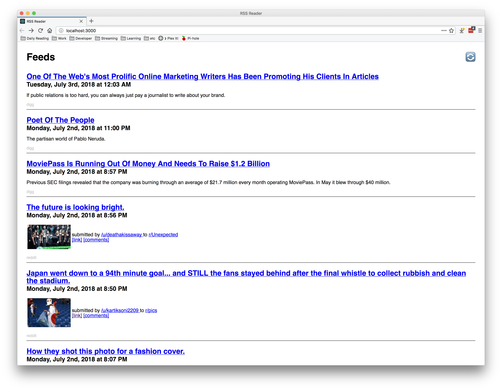

# RSS Reader

Just playing around to see how hard it would be to make an RSS reader. Turns out, not that hard at all!

Wanna try it out? OK.

* Clone this repo
* Run `npm install`
* Run `yarn start`

There are two feeds being pulled in -- Digg and Reddit.

Maybe I'll do something more with this later. Maybe not. Probably not.

Uses [rss-parser](https://github.com/bobby-brennan/rss-parser) to parse RSS feeds.

This project was bootstrapped with [Create React App](https://github.com/facebookincubator/create-react-app).
